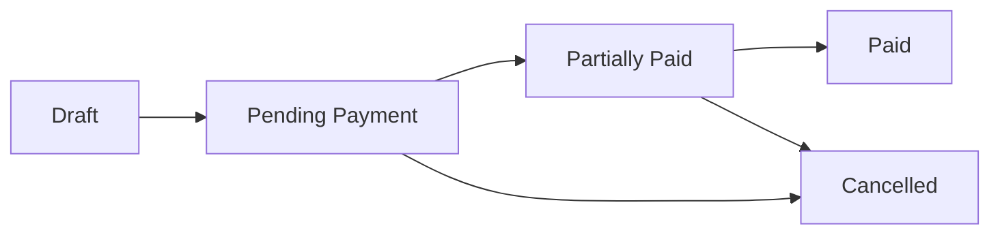

## Overview

OptiFlow's invoicing system provides complete invoice lifecycle management from creation to payment. The system handles complex tax calculations, generates professional PDFs, tracks payments, and automatically updates inventory when invoices are created.

<Info>
Invoices are workspace-scoped, ensuring each business location maintains separate invoicing records and sequences.
</Info>

## Key Features

<CardGroup cols={2}>
  <Card title="Automated Calculations" icon="calculator">
    Automatic subtotal, tax, discount, and total calculations with support for multiple tax types and rates.
  </Card>
  
  <Card title="Payment Tracking" icon="credit-card">
    Track partial and full payments with multiple payment methods and automatic status updates.
  </Card>
  
  <Card title="PDF Generation" icon="file-pdf">
    Generate professional PDF invoices with your branding and business information.
  </Card>
  
  <Card title="Inventory Integration" icon="boxes-stacked">
    Automatically decrease stock levels when invoices are created and restore stock when invoices are deleted.
  </Card>
</CardGroup>

## Invoice Structure

### Core Properties

```php
// Invoice model (app/Models/Invoice.php)
$invoice = Invoice::create([
    'workspace_id' => $workspace->id,
    'contact_id' => $customer->id,
    'document_subtype_id' => $documentSubtype->id,
    'document_number' => 'INV-2024-0001',
    'status' => InvoiceStatus::PendingPayment,
    'issue_date' => now(),
    'due_date' => now()->addDays(30),
    'payment_term' => 'Net 30',
    'subtotal_amount' => 100.00,
    'tax_amount' => 18.00,
    'discount_amount' => 0.00,
    'total_amount' => 118.00,
    'notes' => 'Thank you for your business',
    'created_by' => auth()->id(),
    'currency_id' => 1,
]);
```

### Invoice Fields

- **Document Number**: Unique invoice number (auto-generated)
- **Status**: Current invoice status (draft, pending payment, paid, etc.)
- **Issue Date**: When invoice was created
- **Due Date**: Payment deadline
- **Payment Term**: Payment terms description
- **Contact**: Customer receiving the invoice
- **Document Subtype**: Invoice type/template
- **Amounts**: Subtotal, tax, discount, and total
- **Notes**: Terms, conditions, or custom message
- **Currency**: Invoice currency
- **Created By**: User who created the invoice

## Invoice Lifecycle

### Invoice Statuses

<Tabs>
  <Tab title="Draft">
    Invoice is being prepared:
    
    - Can be edited freely
    - Not counted in financial reports
    - Stock not affected
    - Cannot receive payments
  </Tab>
  
  <Tab title="Pending Payment">
    Invoice issued and awaiting payment:
    
    - Counted in accounts receivable
    - Stock decreased
    - Can receive payments
    - Can be edited (if no payments)
  </Tab>
  
  <Tab title="Partially Paid">
    Some payment received:
    
    - Shows amount paid and amount due
    - Cannot be edited
    - Can receive additional payments
  </Tab>
  
  <Tab title="Paid">
    Fully paid:
    
    - No amount due
    - Cannot be edited or deleted
    - Payment complete
  </Tab>
  
  <Tab title="Cancelled">
    Invoice cancelled:
    
    - Stock restored
    - Cannot receive payments
    - Cannot be edited
  </Tab>
</Tabs>

### Status Flow



## Creating Invoices

### Invoice Workflow

```php
// Using InvoiceController (app/Http/Controllers/InvoiceController.php)
use App\Actions\CreateInvoiceAction;

$result = CreateInvoiceAction::handle($workspace, [
    'contact_id' => $customer->id,
    'document_subtype_id' => $documentSubtype->id,
    'issue_date' => now(),
    'due_date' => now()->addDays(30),
    'items' => [
        [
            'product_id' => $product->id,
            'description' => 'Premium Widget',
            'quantity' => 5,
            'unit_price' => 99.99,
            'discount' => 0,
            'tax_ids' => [1, 2], // Apply multiple taxes
        ],
    ],
    'notes' => 'Net 30 payment terms',
]);
```

### Invoice Items

Each invoice contains line items:

```php
// InvoiceItem model
$item = InvoiceItem::create([
    'invoice_id' => $invoice->id,
    'product_id' => $product->id,
    'description' => 'Premium Widget',
    'quantity' => 5,
    'unit_price' => 99.99,
    'discount' => 10.00, // 10% discount
    'tax_amount' => 80.99,
    'total' => 529.94, // Calculated automatically
]);

// Attach taxes to item
$item->taxes()->attach([1, 2]);
```

<Note>
Item totals are calculated as: `(quantity * unit_price) - discount + tax_amount`
</Note>

## Tax Handling

### Tax Types

OptiFlow supports multiple tax types:

- **VAT/Sales Tax**: Standard sales tax
- **Excise Tax**: Special product taxes
- **Withholding Tax**: Tax withheld from total

### Applying Taxes

```php
// Taxes are grouped by type for the UI
$taxesGroupedByType = Tax::query()
    ->orderBy('is_default', 'desc')
    ->get()
    ->groupBy('type')
    ->mapWithKeys(fn ($taxes, $type) => [
        $type => [
            'label' => TaxType::from($type)->label(),
            'isExclusive' => TaxType::from($type)->isExclusive(),
            'taxes' => $taxes->toArray(),
        ],
    ]);

// Multiple taxes can be applied to each invoice item
```

## Payment Management

### Recording Payments

```php
// Create a payment
$payment = Payment::create([
    'invoice_id' => $invoice->id,
    'amount' => 118.00,
    'payment_method' => PaymentMethod::Transfer,
    'payment_date' => now(),
    'bank_account_id' => $bankAccount->id,
    'reference' => 'WIRE-12345',
    'notes' => 'Wire transfer received',
]);

// Invoice status updates automatically
$invoice->updatePaymentStatus();
```

### Payment Methods

Supported payment methods:

- Cash
- Bank Transfer
- Check
- Credit Card
- Debit Card
- Other

### Payment Status Updates

The invoice status automatically updates based on payments:

```php
// Automatic status update logic (app/Models/Invoice.php:180)
public function updatePaymentStatus(): void
{
    $totalPaid = $this->payments()->sum('amount');
    
    if ($totalPaid >= $this->total_amount) {
        $this->update(['status' => InvoiceStatus::Paid]);
    } elseif ($totalPaid > 0) {
        $this->update(['status' => InvoiceStatus::PartiallyPaid]);
    } else {
        $this->update(['status' => InvoiceStatus::PendingPayment]);
    }
}
```

### Payment Tracking

```php
// Get all payments for invoice
$payments = $invoice->payments;

// Calculate amounts
$amountPaid = $invoice->amount_paid; // Total received
$amountDue = $invoice->amount_due;   // Remaining balance

// Check if can receive payment
if ($invoice->canRegisterPayment()) {
    // Accept payment
}
```

## PDF Generation

Generate professional PDF invoices:

```php
// Download invoice PDF
use App\Http\Controllers\DownloadInvoicePdfController;

// Route: GET /invoices/{invoice}/pdf
// Controller handles PDF generation with company details and branding
```

### Bulk PDF Download

```php
// Download multiple invoices as ZIP
use App\Http\Controllers\BulkDownloadInvoicePdfController;

// Generate PDFs for selected invoices
```

## Stock Integration

Invoices automatically affect inventory:

```php
// When invoice is created:
// - Stock movements are created for each item
// - Inventory is decreased

// Get stock movements for invoice
$movements = $invoice->stockMovements;

// Each movement tracks:
// - Product sold
// - Quantity
// - Related invoice
// - Workspace
```

<Warning>
Deleting an invoice restores stock to inventory. Ensure you have proper permissions before allowing invoice deletion.
</Warning>

## Invoice Validation

### Edit Restrictions

```php
// Check if invoice can be edited
if ($invoice->canBeEdited()) {
    // Only invoices without payments can be edited
}

// Check if invoice can be deleted
if ($invoice->canBeDeleted()) {
    // Cannot delete paid or partially paid invoices
}

// Check if can register payment
if ($invoice->canRegisterPayment()) {
    // Cannot pay draft, cancelled, or fully paid invoices
}
```

## Salesmen & Commissions

Track salespeople on invoices:

```php
// Attach salesmen to invoice
$invoice->salesmen()->attach([1, 2]);

// Get salesmen for invoice
$salesmen = $invoice->salesmen;
```

## Activity Logging

Invoices track all changes:

```php
// Get activity log
$activities = Activity::query()
    ->where('subject_type', 'invoice')
    ->where('subject_id', $invoice->id)
    ->with('causer')
    ->get();

// Logged changes include:
// - Contact changes
// - Document number updates
// - Date modifications
// - Payment term changes
```

## Comments & Notes

Add internal comments to invoices:

```php
// Invoices support comments
$invoice->comments; // All comments

// Add comment
$comment = $invoice->comments()->create([
    'body' => 'Customer requested payment extension',
    'commentator_id' => auth()->id(),
]);
```

## Use Cases

<AccordionGroup>
  <Accordion title="Retail Sales">
    Generate invoices for retail sales with automatic tax calculation, inventory updates, and payment tracking.
  </Accordion>
  
  <Accordion title="B2B Invoicing">
    Create invoices with net payment terms, multiple items, bulk discounts, and payment tracking for business customers.
  </Accordion>
  
  <Accordion title="Recurring Billing">
    Set up recurring invoices for subscription services or regular customers with consistent payment terms.
  </Accordion>
  
  <Accordion title="Payment Plans">
    Track partial payments for large invoices with installment payment arrangements.
  </Accordion>
</AccordionGroup>

## Best Practices

<CardGroup cols={1}>
  <Card title="Payment Terms">
    Clearly specify payment terms and due dates on all invoices to set customer expectations.
  </Card>
  
  <Card title="Sequential Numbering">
    Use document subtypes to maintain proper sequential numbering for different invoice types.
  </Card>
  
  <Card title="Stock Validation">
    Always verify sufficient stock before creating invoices to prevent overselling.
  </Card>
  
  <Card title="Payment Recording">
    Record payments promptly to maintain accurate accounts receivable and customer balances.
  </Card>
</CardGroup>

## API Reference

Key invoice model methods:

- `recalculateTotal()` - Recalculate total from items
- `updatePaymentStatus()` - Update status based on payments
- `canBeEdited()` - Check if editable
- `canBeDeleted()` - Check if deletable
- `canRegisterPayment()` - Check if can receive payment
- `contact()` - Relationship to Contact
- `items()` - Relationship to InvoiceItem
- `payments()` - Relationship to Payment
- `stockMovements()` - Relationship to StockMovement
- `salesmen()` - Relationship to Salesman

Model location: `app/Models/Invoice.php:1`

Controller location: `app/Http/Controllers/InvoiceController.php:1`

## Related Resources

- [Quotations](/features/quotations)
- [Contact Management](/features/contacts)
- [Inventory Management](/features/inventory-management)
- [Payment Processing](/guides/creating-invoices)